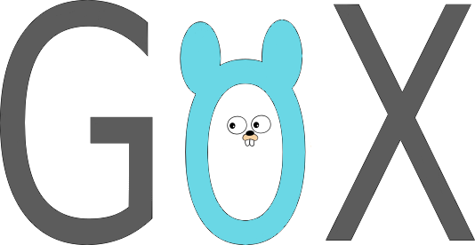
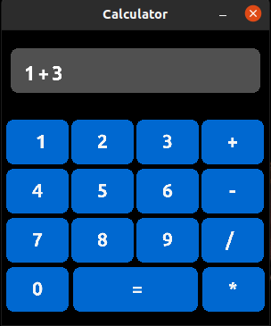
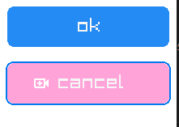
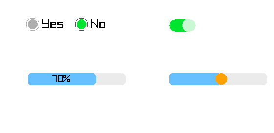
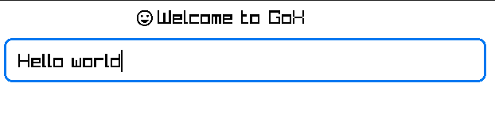
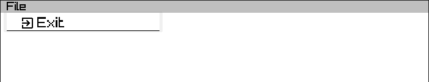

<h1 style="text-align: center;">New Desktop Gui For Golang</h1>

<p align="center">
    
</p>

<hr>

#### this is New Gui App (My goal is  make easy-use Gui I try avoid Complexity ) For Linux and Window And Mac os  andriod in the future 
 
> **_NOTE:_**  this version is beta not stable 
may have bug just test on the Ubuntu 20.4 and Window

features
--------
- Button
- Input 
- CheckBox
- RadioButton
- Icons
- MenuBar
- MenuFloat
- Notify
- TabBar
- SlideBar
- Topbar
- Image 
- Progress
- SideBar
- Board
- Modal

in th futhre
------------
- Flex
- Select
- multi windows
- New style
- Card
- multi languages (now only English Persion and Arbic is Ready Add After Test )
- Spinner
- List
- Table
- Accordions
- ....


### Requirements

##### Ubuntu

###### X11

    apt-get install libgl1-mesa-dev libxi-dev libxcursor-dev libxrandr-dev libxinerama-dev

###### Wayland

    apt-get install libgl1-mesa-dev libwayland-dev libxkbcommon-dev

##### Fedora

###### X11

    dnf install mesa-libGL-devel libXi-devel libXcursor-devel libXrandr-devel libXinerama-devel

###### Wayland

    dnf install mesa-libGL-devel wayland-devel libxkbcommon-devel

##### macOS

On macOS you need Xcode or Command Line Tools for Xcode.

##### Windows

###### cgo

On Windows you need C compiler, like [Mingw-w64](https://mingw-w64.org) or [TDM-GCC](http://tdm-gcc.tdragon.net/).
You can also build binary in [MSYS2](https://msys2.github.io/) shell.

To remove console window, build with `-ldflags "-H=windowsgui"`.

###### purego (without cgo, i.e. CGO_ENABLED=0)

Download the raylib.dll from the assets on the [releases page](https://github.com/raysan5/raylib/releases). It is contained in the `raylib-*_win64_msvc*.zip`.
Put the raylib.dll into the root folder of your project or copy it into `C:\Windows\System32` for a system-wide installation.

As of November 15, 2023, raylib 5.0 is the required version.

It is also possible build the dll yourself. You can find more infos at [raylib's wiki](https://github.com/raysan5/raylib/wiki/Working-on-Windows).


Installation
----------

```go
/// this package use raylib-go
go get "github.com/mohsengreen1388/gox/widgets"
```

writing by Gox
--------------

<p align="center">
    
</p>

Init Project
``` go

package main

import gox "github.com/mohsengreen1388/gox/widgets"

func main() {
	app := gox.Init("App",700,400)
	
	// instance object here
	text := app.Newlabel()
	text.TextColor = gox.BLUE
	text.TextSize = 25		
	
	gox.Update(app,func() {
		// draw object here	
		text.Draw("Welcome to GoX",float32(app.GetScreenWidth())/2.5,float32(app.GetScreenHeight())/2.5)

	})
}

```
> **_NOTE:_**  raylib-go not needs to init and update

#### the board can change page   

``` go

	// init board
	boardOne := app.NewBoard()
	boardTwo := app.NewBoard()

	//set DefulteBoard is necessary
	app.DefulteBoard = boardOne

	//init buttons for content board
	bu1 := app.NewButton()
	bu1.Text = "page two"
	bu1.BackgroundColor = gox.PINK
	bu1.FuncExce = func() {
		changeBoardToTwo(app,boardTwo)
	}

	bu2 := app.NewButton()
	bu2.Text = "To page one"
	bu2.FuncExce = func() {
		changeBoardToTwo(app,boardOne)
	}

	boardOne.AddChild(bu1)
	boardTwo.AddChild(bu2)

```

#### Tab

```go

	tab := app.NewTab(3,false)
	tab.ItemName(0,"Home")
	tab.AddItemFun(0,func ()  {
			// your code
	})

	// inside update
	tab.draw(0,0)
```
<p align="center">
    
</p>

### Button

```go

	button := app.NewButton()
		button.Text = "ok"
		button.BackgroundColor = gox.BLUE
		button2 := app.NewButton()
		button2.Text = "cancel"
		button2.BackgroundColor = gox.PINK
		button2.Icon = gox.AddVideo
		button2.FuncExce = func() {
			// your code run
		}

		// inside update
		button.Draw(10,10,200,50)
		button2.Draw(10,80,200,50)
```

<p align="center">
    
</p>

#### checkBox RadioButton Progress SliderBar

```go

		check := app.NewCheckBox()
		radio := app.NewRadioButton("Yes",true,"1")
		radio2 := app.NewRadioButton("No",false,"1")
		progress := app.NewProgress(70,200)
		bar := app.NewSliderBar(0,100,200)

		// inside update
		check.Draw(350,40)
		radio.Draw(70,50)
		radio2.Draw(170,50)
		progress.Draw(60,150)
		bar.Draw(350,150)
```

<p align="center">
    
</p>


#### Text Input

```go
		label := app.Newlabel()
		label.Icon = gox.EmojiEmotions
		input := app.NewInput()

		// inside update
		label.Draw("Welcome to GoX",200,10)
		input.Draw(10,50,600,50)
```

<p align="center">
    
</p>

		menu := app.NewMeneBar()
		menuFloat := app.NewMeneFloat()
		menuFloat.AddSubMenu("Exit",gox.ExitToApp,"",func() {
			// your code
		})
		menu.AddItem("File",menuFloat)


#### Menu

```go
		menu := app.NewMeneBar()
		menuFloat := app.NewMeneFloat()
		menuFloat.AddSubMenu("Exit",gox.ExitToApp,"",func() {
			// your code
		})
		menu.AddItem("File",menuFloat)

		// inside update
		menu.draw()
```

<p align="center">
    
</p>

# functions
- draw for draw object
- SetPostion for set x,y
- GetText,SetText get set text inside input text
- LoadFont set font the app
- GetScreenHeight
- GetScreenWidth
- MouseX 
- MouseY
- .....


### Cross-compile (Linux)

To cross-compile for Windows install [MinGW](https://www.mingw-w64.org/) toolchain.

```
$ CGO_ENABLED=1 CC=x86_64-w64-mingw32-gcc GOOS=windows GOARCH=amd64 go build -ldflags "-s -w"
$ file basic_window.exe
basic_window.exe: PE32+ executable (console) x86-64 (stripped to external PDB), for MS Windows, 11 sections

$ CGO_ENABLED=1 CC=i686-w64-mingw32-gcc GOOS=windows GOARCH=386 go build -ldflags "-s -w"
$ file basic_window.exe
basic_window.exe: PE32 executable (console) Intel 80386 (stripped to external PDB), for MS Windows, 9 sections
```

To cross-compile for macOS install [OSXCross](https://github.com/tpoechtrager/osxcross) toolchain.

```
$ CGO_ENABLED=1 CC=x86_64-apple-darwin21.1-clang GOOS=darwin GOARCH=amd64 go build -ldflags "-linkmode external -s -w '-extldflags=-mmacosx-version-min=10.15'"
$ file basic_window
basic_window: Mach-O 64-bit x86_64 executable, flags:<NOUNDEFS|DYLDLINK|TWOLEVEL>

$ CGO_ENABLED=1 CC=aarch64-apple-darwin21.1-clang GOOS=darwin GOARCH=arm64 go build -ldflags "-linkmode external -s -w '-extldflags=-mmacosx-version-min=12.0.0'"
$ file basic_window
basic_window: Mach-O 64-bit arm64 executable, flags:<NOUNDEFS|DYLDLINK|TWOLEVEL|PIE>
```